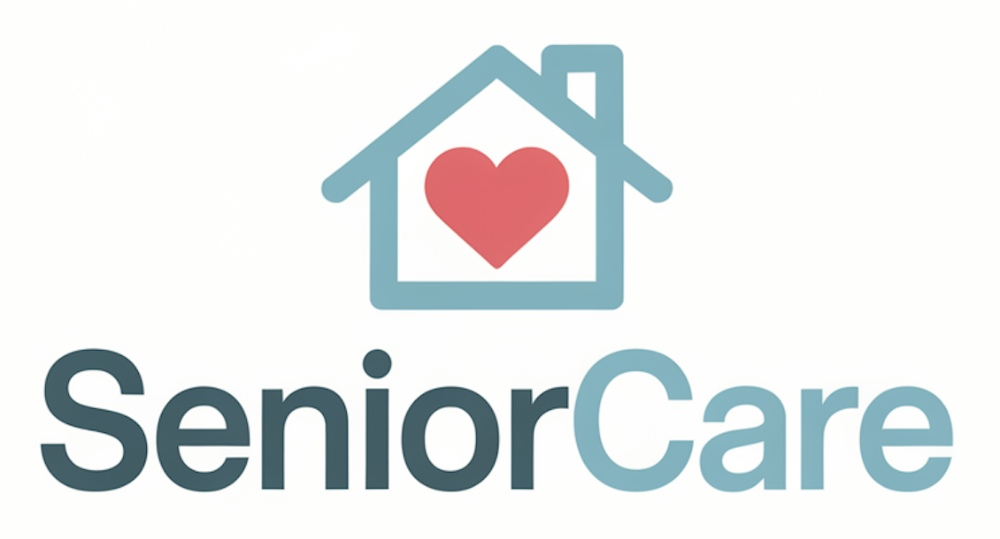

# SeniorCare
SeniorCare es una aplicación diseñada para optimizar la gestión del cuidado de personas mayores en residencias, proporcionando una plataforma integral que facilita el registro y seguimiento de información crucial para su bienestar. Permite a los cuidadores gestionar de manera centralizada los datos de los residentes, coordinar actividades programadas, llevar un control de los medicamentos y prescripciones, así como registrar el bienestar general de los usuarios. Mediante el registro de actividades, medicamentos y prescripciones asociadas a cada residente, se asegura una atención personalizada y acorde a las necesidades de cada individuo. Además, el seguimiento del bienestar de los residentes, en términos de estado de ánimo, energía y otras variables, permite a los cuidadores detectar cualquier cambio relevante en su salud física o emocional. Todo esto contribuye a garantizar que las personas mayores reciban una atención de calidad, con un control constante de su estado y un acceso fácil y eficiente a la información relevante para su cuidado

# Licencia

Este proyecto está distribuido bajo la licencia [MIT](LICENSE). Para más detalles, revisa el archivo ⁠[LICENSE](LICENSE).

# Enlace a documentación adicional
Información sobre entidades y atributos [aqui](docs/EA.md)
# Hitos
- [Hito 1](docs/hito1.md)
- [Hito 2](docs/hito2.md)
- [Hito 3](docs/hito3.md)
- [Hito 4](docs/hito4.md)
- [Hito 5](docs/hito5.md)
