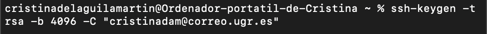

#Configuración del entorno de trabajo
En primer lugar, he descargado git para Mac desde la línea de comandos. Una vez instalado, he añadido mi nombre y correo electrónico.

##Creación de un par de claves SSH
Utilizo el siguiente comando para crear el par de claves pública y privada de SSH:

