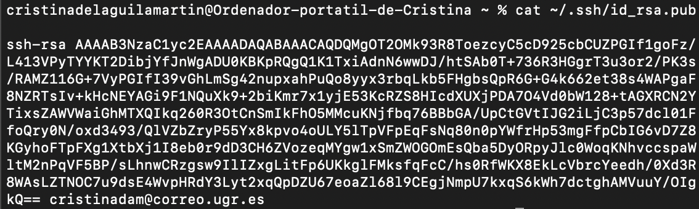

# Configuración del entorno de trabajo
En primer lugar, he descargado git para Mac desde la línea de comandos. Una vez instalado, he añadido mi nombre y correo electrónico.

## Creación de un par de claves SSH
Utilizo el siguiente comando para crear el par de claves pública y privada de SSH:

A continuación copio la clave pública

Añado mi clave pública a GitHub (Settings > SSH and GPG keys > New SSH Key)

## Configuración de Git
Configuro mi nombre y correo electrónico para que aparezca en los commits. 

	git config --global user.name "Cristina del Aguila" 
	git config --global user.email "cristinadam@correo.ugr.es"

## Edito mi perfil de GitHub
Añado una foto de perfil y reviso los campos de nombre, ciudad y universidad para que estén visibles

## Activar autenticación de dos factores
Activo el segundo factor de autenticación para incrementar la seguridad de mi cuenta (en GitHub: Settings > Password and authentication > Two-factor authentication)

## Creación del repositorio 
- En GitHub creo un nuevo repositorio al que llamo proyecto-CC
- Inicializo el repositorio con un archivo README.md, .gitignore y un archivo de licencia del tipo MIT License.

