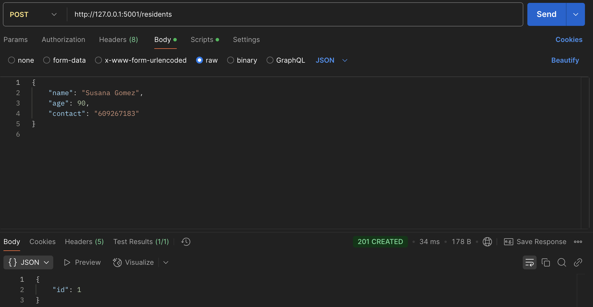
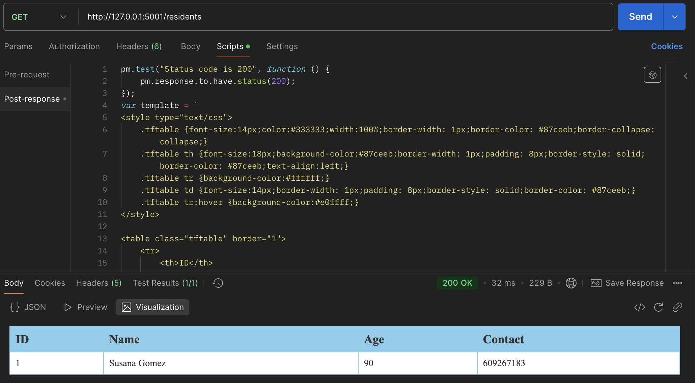
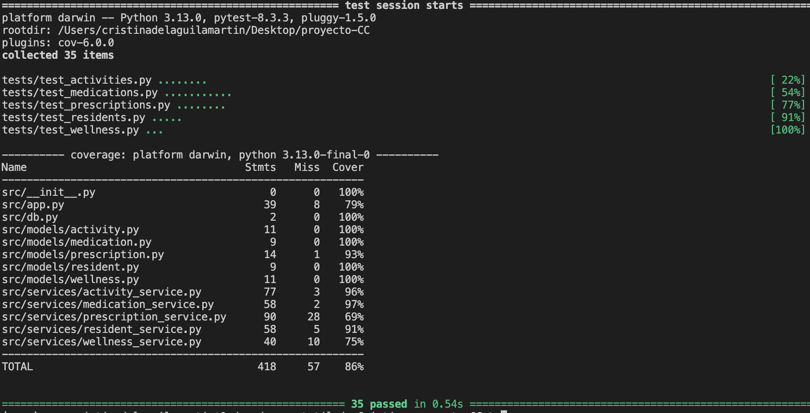
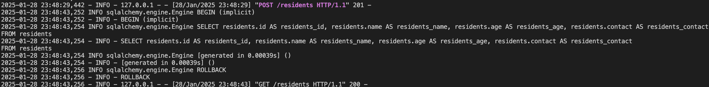

# Hito 3

## Introducción
En este hito, he desarrollado un microservicio basado en la funcionalidad que había implementado en el [hito 2]("hito2")
He hecho lo siguiente:
- Diseñar una API REST 
- Añadir un sistema de logs para registrar la actividad de la API
- Testear la API
- Probar las rutas usando Postman

## Justificación técnica del framework elegido para el microservicio
He elegido Flask como framework para desarrollar mi microservicio porque es bastante sencillo de usar y ligero, lo cual me viene muy bien para implementar la API REST que permita gestionar los residentes. Además, tiene con una comunidad grande y buena documentación, lo que facilita encontrar soluciones si surge algún problema.

Otro punto importante es que Flask tiene extensiones que se pueden añadir fácilmente para cosas más avanzadas, como autenticación o manejo de bases de datos, si en el futuro quiero ampliar el proyecto. Pero para este hito, que requiere crear rutas REST simples y manejar peticiones, Flask es perfecto porque ya incluye todo lo necesario sin ser complicado.

## Diseño de la API

Se encarga de gestionar las actividades, medicaciones, prescripciones, residentes y registros de bienestar. Ofrece varios endpoints que permiten realizar operaciones CRUD (Crear, Leer, Actualizar y Eliminar) sobre los diferentes recursos de la plataforma.

1. Actividades
he creado un conjunto de rutas para gestionar las actividades, donde se pueden agregar, consultar, actualizar y eliminar actividades. Para la creación de nuevas actividades, he implementado un endpoint POST que recibe datos como el nombre, la descripción, la fecha y la duración de la actividad. También he desarrollado un endpoint GET para obtener todas las actividades o una actividad específica por su ID. Para actualizar una actividad, he utilizado el método PUT, y para eliminarla, el método DELETE.

2. Medicaciones
he diseñado un conjunto de rutas para gestionar las medicaciones disponibles en el sistema. Al igual que con las actividades, he implementado un endpoint POST para agregar nuevas medicaciones, un GET para obtener todas las medicaciones o una medicación por su ID, un PUT para actualizar los datos de una medicación y un DELETE para eliminarla.

3. Prescripciones
para las prescripciones, he añadido rutas que permiten crear, consultar, actualizar y eliminar prescripciones. El endpoint POST permite crear una nueva prescripción asociada a un residente y una medicación específica. También he implementado un GET para obtener todas las prescripciones o una por su ID. Para actualizar una prescripción, he utilizado el método PUT, y el DELETE permite eliminar una prescripción.

4. Residentes
en cuanto a los residentes, he creado rutas para agregar nuevos residentes, obtener información sobre todos los residentes o un residente específico, actualizar los datos de un residente y eliminarlo. El endpoint POST permite agregar nuevos residentes, mientras que el GET recupera todos los residentes o uno específico mediante su ID. También he implementado un endpoint PUT para actualizar los datos del residente y un DELETE para eliminarlo.

5. Bienestar
por último, para el bienestar de los residentes, he implementado una serie de rutas para registrar, consultar y eliminar registros de bienestar. El endpoint POST permite registrar el bienestar de un residente, incluyendo su estado de ánimo, nivel de energía y notas adicionales. He añadido un GET para obtener todos los registros de bienestar y un DELETE para eliminar un registro de bienestar.

### Uso de Postman
Para verificar que la API funcionaba bien he usado **Postman** para realizar pruebas manuales. Con Postman he enviado solicitudes HTTP a cada una de las rutas, comprobando:
1. El manejo correcto de las peticiones válidas.
2. La gestión de errores, como intentar actualizar o eliminar un residente que no existe.

Con esto he podido visualizar las respuestas en tiempo real y asegurarme de que los datos que devuelve la API son correctos.

Por ejemplo:
- Crear un residente

- Ver los residentes 

##  Tests
He implementado un conjunto de pruebas unitarias para asegurar que los endpoints de la API funcionan correctamente, cumpliendo con los requisitos funcionales y validando las respuestas ante diferentes tipos de entradas. Están organizadas en distintos grupos, cada uno orientado a probar una funcionalidad específica de la API. A continuación, explico en detalle los tests que he implementado:

1. Pruebas para el Endpoint de actividades: 
- `test_create_activity`: verifica que la creación de una nueva actividad funciona correctamente. Para esto, envía una solicitud POST con todos los campos requeridos (nombre, descripción, fecha, duración, ubicación) y valida que el código de estado sea 201 (Creado), además de comprobar que los datos enviados están presentes en la respuesta.
- `test_create_activity_missing_fields`: verifico que si falta algún campo obligatorio en los datos enviados, el sistema responda con un error 400 y el mensaje "Faltan datos obligatorios".
- `test_create_activity_invalid_date`: si la fecha de la actividad no tiene el formato adecuado (en este caso, el formato ISO 8601), el sistema debe responder con un error 400, indicando que el formato de fecha es inválido.
- `test_get_activities`: verifica que el endpoint `GET` de actividades devuelve correctamente todas las actividades almacenadas en la base de datos, y que si no hay actividades, retorna una lista vacía.
- `test_update_activity`: verifica que se pueda actualizar una actividad existente, modificando los datos de la actividad (como el nombre, la descripción, la fecha, etc.) y asegurándome de que los cambios se reflejen correctamente.
- `test_delete_activity`: valida que una actividad se pueda eliminar correctamente, tanto asegurando que el código de estado sea 200 (OK) como verificando que al intentar obtener la actividad eliminada, el sistema responda con un error 404.

2. Pruebas para el Endpoint de medicamentos
- `test_add_medication`: verifica que se puede agregar un medicamento a la base de datos, comprobando que la respuesta contenga un ID único para el nuevo medicamento.
- `test_add_medication_missing_fields`: si faltan campos obligatorios en los datos del medicamento (como la descripción), esta prueba valida que el sistema responda con un error 400 indicando que faltan datos.
- `test_remove_medication`: aquí se valida que se pueda eliminar un medicamento correctamente, asegurándose de que al eliminarlo, el medicamento ya no exista en la base de datos.
- `test_update_medication`: verifica que sea posible actualizar los detalles de un medicamento, como la descripción, y que los cambios se reflejen correctamente en la base de datos.
- `test_get_all_medications`: asegura que la respuesta devuelta por la solicitud GET contenga todos los medicamentos registrados en la base de datos, verificando también el contenido de la lista.

3. Pruebas para el Endpoint de prescripciones
- `test_add_prescription`: aquí se prueba que una nueva prescripción se pueda agregar correctamente a la base de datos, validando que la respuesta contenga un ID válido.
- `test_add_prescription_missing_fields`: valida que si falta algún campo obligatorio al agregar una prescripción (como el ID del medicamento), el sistema devuelva un error 400.
- `test_add_prescription_invalid_dates`: verifico que el sistema maneje correctamente errores en las fechas, como cuando la fecha de inicio o finalización no es válida, respondiendo con un error 400.
- `test_remove_prescription`: en esta prueba, verifico que sea posible eliminar una prescripción correctamente y que, una vez eliminada, ya no exista en la base de datos.
- `test_update_prescription_not_found`: valido que al intentar actualizar una prescripción que no existe, el sistema responda con un error 404.

4. Pruebas para el Endpoint de residentes
- `test_add_resident`: verifico que se pueda agregar un residente a la base de datos con la información requerida (nombre, edad, contacto), validando que la respuesta contenga un ID para el residente recién creado.
- `test_get_residents`: esta prueba verifica que la lista de residentes se obtenga correctamente. Si no hay residentes en la base de datos, debe devolver una lista vacía.
- `test_add_resident_missing_data`: valido que si falta algún campo obligatorio (como el contacto) al agregar un residente, el sistema retorne un error 400 con el mensaje "Faltan datos".
- `test_delete_resident`: asegura que un residente se pueda eliminar correctamente de la base de datos. Después de eliminarlo, intento obtener el residente y verifico que el sistema devuelva un error 404.

5. Pruebas para el Endpoint de seguimiento de bienestar
- `test_register_wellness`: verifica que se pueda registrar un nuevo seguimiento de bienestar para un residente, comprobando que los datos sean almacenados correctamente en la base de datos.
- `test_register_wellness_missing_fields`: verifico que si falta algún dato obligatorio en el seguimiento de bienestar (como el estado de ánimo o el nivel de energía), el sistema responda con un error 400.
- `test_get_wellness_records`: verifico que todos los registros de bienestar se obtengan correctamente, y que la respuesta contenga los registros esperados

Resultado de la ejecución de los tests:

## Sistema de Logs
He implementado un sistema de logs en la API para registrar su actividad, tener un monitoreo eficiente y facilitar la depuración de errores. Para esto he usado el módulo nativo de Python `logging`, integrado directamente con Flask.

1. Definición de niveles de registro:
He configurado los logs para capturar eventos en diferentes niveles (INFO, WARNING, ERROR), estableciendo un formato claro que incluye la fecha, el nivel de registro y el mensaje del evento. 
- `INFO` sirve para capturar eventos generales del sistema, como la inicialización de servicios o el procesamiento exitoso de solicitudes.
- Los errores críticos y advertencias se registran con los niveles `ERROR` y `WARNING`, lo que permite diferenciarlos y priorizarlos en la supervisión.

2. Formato de los logs: cada línea de log incluye la marca de tiempo `(%(asctime)s)`, el nivel de registro `(%(levelname)s)` y el mensaje del evento `(%(message)s)`, lo que da un contexto completo sobre cada evento registrado.

3. Manejadores: he definido dos manejadores
- uno para almacenar los registros en el archivo logs/api_activity.log
- otro para mostrar los eventos en la consola

Esto permite un monitoreo en tiempo real durante las pruebas y el desarrollo.

### Ejemplos de Logs
- Al añadir un residente y ver los residentes:

