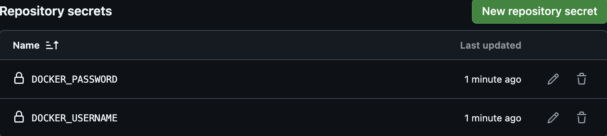

# Hito 4
## Estructura del clúster de contenedores
El clúster de contenedores diseñado para este proyecto tiene como objetivo principal organizar y aislar cada componente de la aplicación. Esto permite que los diferentes servicios y dependencias puedan interactuar entre sí sin conflictos y facilita la escalabilidad y la portabilidad del sistema. A continuación, voy a explicar la estructura que he usado:

### Estructura general del clúster
El clúster está compuesto por varios contenedores, cada uno con una responsabilidad específica:

1. Contenedor principal (aplicación): ejecuta la lógica principal de la aplicación. Contiene todos los modelos y servicios necesarios para gestionar las diferentes funcionalidades del sistema. Se basa en el archivo `app.py`, que actúa como el punto de entrada para los diferentes endpoints de la API.
2. Contenedor de base de datos: almacena toda la información de la aplicación, como los datos relacionados con actividades, medicamentos, recetas, residentes y el bienestar. Utiliza el archivo `database.db` y está configurado como un volumen para garantizar la persistencia de los datos.
3. Contenedor de tests: se usa para ejecutar pruebas automáticas y verificar que los servicios, modelos y la integración del sistema funcionan correctamente.

Cada contenedor interactúa dentro de una red común definida en `docker-compose.yml`

## Configuración de cada uno de los contenedores que componen el clúster de contenedores
### Contenedor de la aplicación
Es el núcleo del sistema, se encarga de ejecutar la lógica principal de la API. Para su construcción, he elegido como imagen base `python:3.10-slim`. En este contenedor se incluyen todos los modelos y servicios necesarios para gestionar las funcionalidades de la aplicación:

1. Modelos: se encuentran en la carpeta `src/models/` e incluyen los archivos `activity.py`, `medication.py`, `prescription.py`, `resident.py` y `wellness.py`. Cada modelo define la estructura de las tablas de la base de datos y sus relaciones.
2. Servicios: están en la carpeta `src/services/` y son responsables de la lógica de negocio. Cada servicio (activity_service.py, medication_service.py, etc.) proporciona funciones para interactuar con los modelos y exponer las funcionalidades mediante la API.
3. API principal: el archivo app.py centraliza la creación de la aplicación Flask, la configuración de la base de datos y la exposición de los endpoints. Este archivo asegura que los diferentes servicios puedan ser accedidos y gestionados a través de rutas HTTP.

Este contenedor mapea el puerto interno `5000` del contenedor al puerto `5000` de la máquina anfitriona para que se pueda acceder a la API desde el exterior. 

### Contenedor de la base de datos
Sirve para almacenar y gestionar los datos que utiliza la aplicación. Para este propósito, he usado la imagen `sqlite:latest`.

El contenedor está configurado para usar el archivo `database.db` como la base de datos principal de la aplicación. Además, he configurado un volumen persistente para garantizar que los datos se conserven incluso si el contenedor se detiene o reinicia. Este volumen asegura que los datos almacenados, como actividades, medicamentos, recetas, residentes y bienestar, no se pierdan.

La configuración de este contenedor incluye su integración en una red común para que pueda interactuar con el contenedor de la aplicación. Esto permite que los modelos definidos en la aplicación se conecten a la base de datos y realicen las operaciones necesarias.

### Contenedor para pruebas
El contenedor de pruebas está dedicado a verificar que la aplicación funciona bien mediante pruebas automatizadas. Este contenedor utiliza la misma imagen base que el contenedor de la aplicación (`python:3.10-slim`) 

En este contenedor se ejecutan las pruebas que validan los modelos, servicios y la integración general del sistema. Estas pruebas están diseñadas para garantizar que los endpoints funcionen como se espera y que la lógica de negocio sea correcta.

El uso de un contenedor separado para las pruebas permite aislar este proceso del entorno de producción. Además, garantiza que los resultados de las pruebas sean reproducibles, ya que el contenedor siempre parte de un entorno limpio y controlado.

### Justificación del uso de contenedores base
La elección de imágenes base ligeras como `python:3.10-slim` y `sqlite:latest` tiene como objetivo optimizar el tamaño de los contenedores y reducir los tiempos de construcción. Estas imágenes se usan mucho y estn muy bien documentadas, lo que facilita su configuración y mantenimiento. Además, aseguran la compatibilidad con las dependencias del proyecto y proporcionan un entorno estable para ejecutar la aplicación, la base de datos y las pruebas.

## Documentación del Dockerfile
El archivo [Dockerfile]("Dockerfile") describe los pasos necesarios para crear un entorno consistente donde se ejecuta la API y todas sus dependencias.

En primer lugar, el [Dockerfile]("Dockerfile") comienza definiendo la imagen base, `python:3.10-slim` ya que proporciona un entorno compatible con todas las dependencias del proyecto. A continuación, he actualizado los paquetes del sistema y he instalado las herramientas básicas necesarias para la instalación de dependencias, como pip. Para que la aplicación pueda gestionar correctamente las bibliotecas necesarias.

Después en el [Dockerfile]("Dockerfile") copia los archivos del proyecto desde el sistema anfitrión al contenedor. Este proceso incluye todos los archivos de la carpeta `src`, que contiene la lógica de los modelos, servicios y el archivo principal `app.py`, que actúa como el punto de entrada de la aplicación. Los archivos se copian en el directorio de trabajo dentro del contenedor, para que todo el código necesario esté disponible en el entorno.

Después de copiar los archivos, he instalado las dependencias del archivo `requirements.txt`. Que incluye bibliotecas como `Flask`, `Flask-RESTful`, `Flask-SQLAlchemy` y herramientas de desarrollo como `pytest` y `flake8`. Estas dependencias permiten que la API funcione correctamente y facilitan las pruebas y el mantenimiento del código. El archivo se puede acceder[aqui]("requirements.txt")

Por último, el [Dockerfile]("Dockerfile") especifica el comando para iniciar la aplicación cuando se ejecuta el contenedor. Esto se hace configurando el comando CMD para que ejecute python `src/app.py`. Este paso sirve para que al iniciar el contenedor, la API esté disponible y lista para recibir peticiones.

## Contenedor subido correctamente a GitHub Packages
El contenedor que contiene la lógica de la aplicación lo he configurado para que se suba automáticamente a GitHub Packages cada vez que se actualiza el repositorio, para que siempre se disponga de una versión actualizada del contenedor, y así facilitar su despliegue en diferentes entornos sin necesidad de reconstruirlo manualmente.

En el archivo `.github/workflows/docker-publish.yml` ([docker-publish.yml](".github/workflows/docker-publish.yml")), he definido el flujo de trabajo que construye el contenedor a partir del archivo [Dockerfile]("Dockerfile") y lo publica en GitHub Packages. Este flujo de trabajo incluye pasos como la autenticación en Docker Hub, la construcción del contenedor y la subida al registro.

La autenticación se hace mediante los secretos `DOCKER_USERNAME` y `DOCKER_PASSWORD`, que los he configurado en la sección "Secrets and variables" del repositorio. Estos secretos contienen las credenciales necesarias para acceder a Docker Hub.

Una vez autenticado, el flujo de trabajo usa el comando `docker build` para construir el contenedor y el comando `docker push` para subirlo al registro de GitHub Packages. La etiqueta del contenedor incluye tanto el número de versión como la etiqueta latest para facilitar el acceso a la versión más reciente.

Cada vez que se realiza un cambio en el repositorio, este flujo de trabajo se ejecuta automáticamente. Para que cualquier actualización en el código fuente o en la configuración de la aplicación se refleje inmediatamente en la imagen del contenedor publicada.

## Fichero de composición del clúster de contenedores `docker-compose.yml`
El archivo `docker-compose.yml` se encarga de definir la infraestructura del clúster de contenedores. En este archivo se describen los contenedores que componen el sistema, las redes a las que están conectados y cómo interactúan entre sí. La configuración de este archivo permite que los contenedores se inicien de forma ordenada y que la comunicación entre ellos sea posible. A continuación, explico cada una de las secciones de este archivo.

1. Versión de Docker Compose: primero he definido la versión de Docker Compose que se va a usar, en este caso, `3.8`. 
2. Servicios: Los servicios que he definido en el archivo son los contenedores que forman el clúster. En este caso, tenemos tres servicios: app, db y test.
- app: es el contenedor principal, que ejecuta la aplicación Flask. El contenedor se construye usando el Dockerfile del proyecto, que contiene la lógica de la aplicación. El servicio mapea el puerto `5000` del contenedor al puerto `5000` de la máquina anfitriona, lo que permite acceder a la API desde el exterior. Además, este servicio depende de los contenedores db y test.

        app:
            build:
            context: .
            dockerfile: Dockerfile
            ports:
            - "5000:5000"
            networks:
            - app-network
            depends_on:
            - db
            - test
            environment:
            - FLASK_APP=src/app.py
            - FLASK_ENV=development

- db: en este servicio uso la imagen de `sqlite:latest` para crear un contenedor con la base de datos. Los datos de la base de datos se almacenan de manera persistente usando un volumen `db-data`. Esto garantiza que los datos no se pierdan incluso si el contenedor se reinicia. Este servicio está en la misma red app-network que el contenedor app, lo que permite que la aplicación acceda a la base de datos.

        db:
            image: sqlite:latest
            volumes:
            - db-data:/data
            networks:
            - app-network
            environment:
            - DB_PATH=/data/database.db

3. test: el contenedor de pruebas usa el mismo Dockerfile que el contenedor app y ejecuta los tests definidos en el proyecto. Este servicio depende de los contenedores `app` y `db` para asegurarse de que la aplicación esté lista y la base de datos esté disponible antes de ejecutar las pruebas. Uso el comando `pytest` para ejecutar las pruebas automáticamente al iniciar el contenedor.

        test:
            build:
            context: .
            dockerfile: Dockerfile
            networks:
            - app-network
            depends_on:
            - app
            - db
            command: pytest

4. Redes: he definido una red que se llama `app-network`, a la cual están conectados todos los contenedores del clúster. La red bridge es la opción predeterminada y asegura que los contenedores puedan comunicarse entre sí de forma segura.

        networks:
        app-network:
            driver: bridge

5. Volúmenes: uso el volumen `db-data` para almacenar de manera persistente los datos de la base de datos en el contenedor db. Al usar un volumen, los datos no se perderán si el contenedor se detiene o reinicia.

        volumes:
        db-data:
