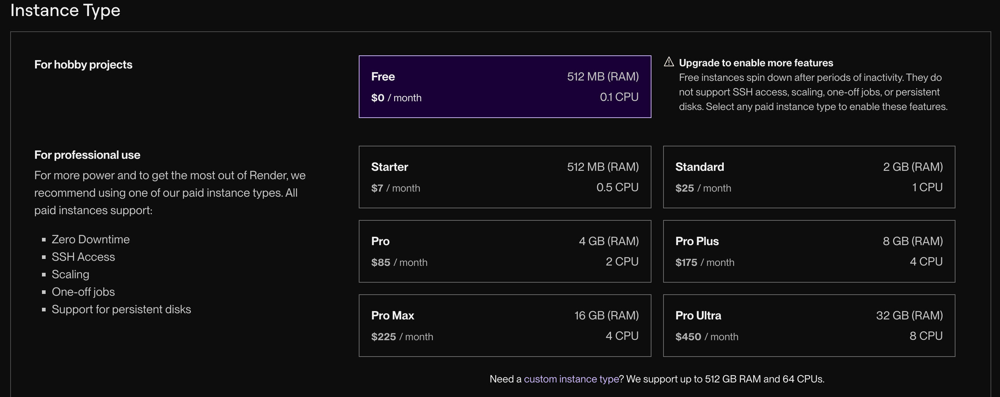

# Hito 5
## Criterios de selección del PaaS para el despliegue 
He elegido Render para el despliegue de mi aplicación basándome en varios criterios. El primero de ellos ha sido la facilidad de uso de la plataforma. Es importante que la plataforma elegida sea fácil de configurar y que me permita realizar el despliegue sin complicaciones técnicas. Como parte de este proceso, he buscado una plataforma que ofreciera compatibilidad con GitHub, para poder realizar despliegues automáticos directamente desde el repositorio de mi aplicación. Esta característica es esencial para agilizar el flujo de trabajo y evitar tener que hacer despliegues manuales.

También he tenido en cuenta la oferta gratuita y precios asequibles de las plataformas. He preferido elegir plataformas que ofrezcan una capa gratuita que cubriera las necesidades básicas del proyecto, pero que también tuvieran opciones de pago escalables en caso de necesitar más recursos más adelante.

Otro criterio que he considerado es la localización del servicio. Como el proyecto debe estar desplegado en Europa para cumplir con los requisitos legales, he buscado PaaS que tengan servidores en esta región.

Las opciones que he valorado son Heroku, Render y Vercel. Al final me he decantado por Render porque ofrece una configuración muy sencilla para despliegues automáticos directamente desde GitHub, se integra bien con servicios de bases de datos y su capa gratuita cubre las necesidades de la aplicación de forma eficiente. Aunque Heroku también era una opción viable, la interfaz de Render me era más familiar (ya tenía una cuenta creada).

## Descripción y justificación de las herramientas usadas para desplegar la aplicación en el PaaS
### Configuración previa
Para preparar el proyecto para su despliegue en la nube, he tenido que realizar varias modificaciones en los archivos del proyecto Las modificaciones realizadas han sido:

1. Modificación del archivo `app.py`:
En primer lugar, he ajustado el archivo `app.py` para permitir que la aplicación funcione en el entorno de producción. Para esto he añadido el siguiente bloque de código, que asegura que la aplicación Flask escuche en todas las interfaces (0.0.0.0) 

        if __name__ == "__main__":
            app.run(host="0.0.0.0", port=int(os.environ.get("PORT", 5000)))

Esto permite que la aplicación sea accesible a través de la URL proporcionada por el PaaS, evitando que se ejecute únicamente en el entorno local.

2. Creación del archivo `Procfile`:
Para que el PaaS reconozca cómo iniciar la aplicación, he creado el archivo `Procfile` en el directorio raíz del proyecto. Este archivo lo usan las plataformas como Render o Heroku para determinar cómo iniciar la aplicación. 

        web: gunicorn src.app:app

3. Revisión y actualización del archivo `requirements.txt`
He verificado que el archivo `requirements.txt` estuviese actualizado con todas las dependencias necesarias para ejecutar la aplicación en producción. Posteriormente me he dado cuenta de que faltaba una.
He añadido `gunicorn`, que es el servidor de aplicaciones recomendado para entornos de producción en plataformas como Render. Sustituye al servidor de desarrollo de Flask para manejar más eficientemente las solicitudes en producción.

### Configuración en Render
La primera herramienta que he usado ha sido GitHub, que como he mencionado antes ofrece integración directa con el PaaS Render, lo que me permite hacer el despliegue de manera automatizada. Esta integración facilita que, con un solo comando o un "push" a la rama principal, la aplicación se despliegue automáticamente en el servidor de Render.

También he usado Docker para que la aplicación se ejecutara de manera consistente en cualquier entorno, tanto en desarrollo como en producción. He podido crear un contenedor que empaquetara todas las dependencias necesarias para ejecutar la aplicación y así hacer más fácil el proceso de despliegue.

Por otro lado, he usado Docker Compose, para definir y ejecutar aplicaciones multicontenedor. Esto es me sirve porque mi aplicación depende de varios servicios, como bases de datos y otros servicios auxiliares, que necesitan ser configurados y ejecutados de manera coordinada. Docker Compose facilita la configuración de estos servicios y garantiza que todos los componentes de la aplicación se desplieguen correctamente.

Para asegurarme de que el entorno estuviera correctamente configurado, he usado el archivo .env para manejar las variables de entorno. Las variables de entorno son fundamentales para mantener configuraciones sensibles, como las credenciales de la base de datos, fuera del código fuente. De esta manera, la aplicación puede acceder a estas configuraciones sin comprometer la seguridad ni la integridad de los datos.

Para gestionar las dependencias del proyecto, he modificado el arquivo `requirements.txt`, el cual se asegura de que todas las librerías necesarias estén disponibles durante el despliegue y he añadido el paquete `python-dotenv` para cargar las variables de entorno desde un archivo `.env`

## Descripción de la configuración para el despliegue automático al PaaS desde el repositorio de GitHub
El despliegue automático desde el repositorio de GitHub a Render sirve para facilitar la integración continua, de modo que cada vez que se realice un `git push` al repositorio, Render pueda detectar los cambios y desplegar la nueva versión de la aplicación automáticamente.

El primer paso ha sido vincular mi repositorio de GitHub a la cuenta de Render. Esto lo he hecho usando la opción de New -> Web Service en Render, seleccionando la opción de despliegue desde GitHub y autenticando mi cuenta de GitHub. 

Después de conectar el repositorio, he configurado el entorno para la aplicación, seleccionando Docker como el lenguaje y la región dentro de EU

Selecciono la opción gratuita

Para habilitar el despliegue automático, selecciono la opción `Auto-Deploy` en Render, lo que permite que cada vez que haya un cambio en la rama principal (en este caso, main), Render inicie un nuevo despliegue. Esta opción automatiza el proceso de integración continua, lo cual es esencial para mantener la aplicación siempre actualizada con la última versión del código.

Durante el proceso de configuración, he tenido problemas relacionados con la falta de ciertas dependencias, como `python-dotenv`, que no estaban incluidas en el archivo `requirements.txt` inicial. Lo que ha hecho que apareciese un error de importación cuando la aplicación intentaba cargar las variables de entorno, y ha resultado en un fallo del despliegue. 

El código modificado en requirements.txt es el siguiente:

        pytest
        pytest-cov
        flake8
        flask==2.3.3
        flask-restful==0.3.9
        flask-sqlalchemy
        gunicorn
        python-dotenv

Después de esto el despliegue ha sido exitoso

## Funcionamiento correcto del despliegue en el PaaS
Para facilitar la visualización y prueba de los endpoints, he integrado Swagger, para tener una interfaz interactiva donde se puedan consultar, enviar y probar solicitudes directamente desde el navegador. Haciendo que la documentación se más clara y accesible de la API (https://seniorcare-rhxe.onrender.com/seniorcare/)

Por ejemplo, voy a crear un residente:

Si hago una solicitud `GET`, obtengo:

También puedo eliminarlo (ya que está pensado para que lo utilicen los trabajadores de la residencia)

Así al hacer la petición `GET`, observamos que el residente ya no está

